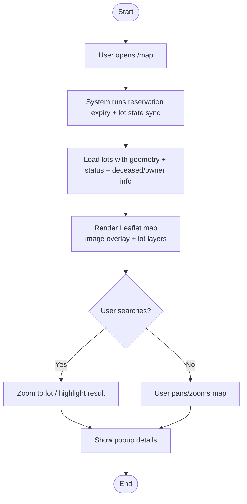
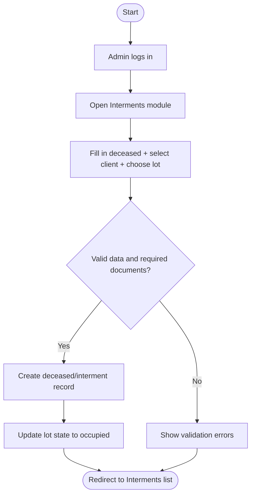

## 6) Design, Development, and Testing

This section documents how the system is **designed**, how it is **developed**, and how it is **tested** using **ISO/IEC 25010** quality characteristics to ensure the system is **functional, reliable, and usable**.

### 6.1 System Design Overview

#### a) High-Level Architecture (Logical View)

The system follows a typical Laravel layered design:

- **Presentation layer**: Blade views + Tailwind UI + Alpine.js interactions; Leaflet.js for the tomb locator map.
- **Application layer**: Controllers + validation + services (e.g., `LotStateService`) that coordinate workflows.
- **Domain/Data layer**: Eloquent models (`Lot`, `Reservation`, `Deceased`, `Client`, `PaymentTransaction`, `VisitorLog`) mapped to MySQL tables.
- **External services**: SMTP for email delivery; Dompdf for PDF generation.

```mermaid
flowchart LR
  V[Visitor / Public User] -->|Browser| UI_Public[Public UI<br/>Blade + Tailwind + Alpine]
  A[Admin / Master Admin] -->|Browser| UI_Admin[Admin UI<br/>Blade + Tailwind + Alpine]

  UI_Public -->|HTTP Requests| APP[Laravel Application]
  UI_Admin -->|HTTP Requests| APP

  APP --> CTR[Controllers<br/>(Auth, Lots, Reservations, Interments, Payments, Visitors, Reports)]
  CTR --> SRV[Services<br/>LotStateService, PDF/Email helpers]
  CTR --> ORM[Eloquent Models]
  ORM --> DB[(MySQL Database)]

  SRV --> PDF[Dompdf<br/>PDF Documents]
  SRV --> SMTP[SMTP (Email)]
  UI_Public <-->|JS| MAP[Leaflet.js Map<br/>Image Overlay + Geometry Layers]
  UI_Admin <-->|JS| MAP
```

#### b) Core Use Cases (Use Case Model)

Key system interactions based on the implemented modules and routes:

```mermaid
usecaseDiagram
  actor Visitor as V
  actor Admin as A
  actor "Master Admin" as M

  rectangle LiliwMemoria {
    (View Tomb Locator Map) as UC1
    (Submit Visitor Log) as UC2
    (Locate Visit Record on Map) as UC3

    (Manage Lots/Plots) as UC4
    (Manage Reservations) as UC5
    (Manage Interments & Exhumations) as UC6
    (Manage Payments & Generate Receipts/Invoices) as UC7
    (View Analytics & Reports) as UC8
    (Manage Users & View Audit Logs) as UC9
  }

  V --> UC1
  V --> UC2
  V --> UC3

  A --> UC4
  A --> UC5
  A --> UC6
  A --> UC7
  A --> UC8

  M --> UC4
  M --> UC5
  M --> UC6
  M --> UC7
  M --> UC8
  M --> UC9
```

#### c) Process Flow Diagrams (Examples)

**Process Flow 1: Tomb Locator (Public Map View)**



**Process Flow 2: Interment Creation (Admin)**



### 6.2 Development Approach

#### a) Method and Standards

Development follows standard web application practices aligned with the existing project structure:

- **Iterative / incremental delivery** per module (lots, map, reservations, interments, payments, visitors, reports).
- **MVC pattern (Laravel)**: routes → controllers → services/models → database → views.
- **Validation and error handling** through Laravel request validation and consistent UI feedback.
- **Role-based access control** using middleware to restrict administration features to `admin` and `master_admin`.
- **Separation of concerns**: shared business rules (e.g., syncing lot state) are implemented in services to avoid duplication across controllers.

#### b) Development Workflow (Local and Deployment)

- **Backend**: PHP 8.2 + Laravel (Composer dependency management).
- **Frontend**: Vite + Tailwind + Alpine (npm build pipeline).
- **Configuration**: environment-based settings via `.env` (database, mail/SMTP, session driver).
- **Version control**: Git for change tracking and collaboration.

### 6.3 Testing Based on ISO/IEC 25010 (Product Quality Model)

Testing is structured around ISO/IEC 25010 quality characteristics. The system combines **automated tests** (Pest/PHPUnit feature tests) with **manual checks** for UI-heavy parts (e.g., interactive maps).

#### a) Quality Characteristics and How They Are Tested

| ISO/IEC 25010 Characteristic | How LiliwMemoria is Tested (Project-Appropriate) | Example Evidence in Project |
|---|---|---|
| **Functional suitability** | Feature tests for core workflows (create interment, validations, contact form submission) | `tests/Feature/IntermentManagementTest.php`, `tests/Feature/ContactFormTest.php` |
| **Performance efficiency** | Manual profiling + browser dev tools for map load, search responsiveness, and PDF downloads; optional load tests in staging | Map rendering in `resources/views/admin/lots/map.blade.php` and public map views |
| **Compatibility** | Cross-browser testing (Chrome/Edge/Firefox) and responsive layout checks (mobile/desktop) | Tailwind-based UI across Blade templates |
| **Usability** | Client-side questionnaire based on ISO 25010 + task-based UI walkthroughs (find a lot, download a contract, submit a visitor log) | `CLIENT_SIDE_QUESTIONNAIRE_ISO25010.md` |
| **Reliability** | Regression tests for critical flows; checks for correct lot state after events (interment confirmed/exhumed; reservation expiry sync) | Lot state rules via `Reservation::expireDue(...)` and `LotStateService::sync(...)` |
| **Security** | Authorization tests for role restrictions; secure session/auth configuration; input validation | `tests/Feature/MaintenanceAuthorizationTest.php` + role middleware on admin routes |
| **Maintainability** | Consistent module organization (controllers/services/models); automated tests for frequent changes; lint/format discipline | Service-oriented shared logic (e.g., `LotStateService`) |
| **Portability** | Environment-configured deployment (.env), standard Laravel stack; tested on common PHP/MySQL hosting setups | `.env.example`, `composer.json`, `vite.config.js` |

#### b) Test Types Used

- **Feature/Integration tests (Pest)**: verify end-to-end behavior from routes/controllers to database writes and redirects.
- **Validation tests**: ensure required fields and documents are enforced (e.g., burial permit requirement before confirming interment).
- **Authorization tests**: ensure only allowed roles can execute administrative actions.
- **UI/Manual tests** (map-heavy screens): verify drawing tools, lot selection, search, popups, and status coloring behave correctly.

#### c) “Functional, Reliable, and Usable” Assurance

- **Functional**: core workflows (lot/interment/payment/visitor operations) are validated and regression-tested.
- **Reliable**: lot status is synchronized and kept consistent across modules (map, reservations, interments).
- **Usable**: public-facing features are evaluated with ISO 25010-based questionnaires and practical user tasks (search, locate, submit, download).
